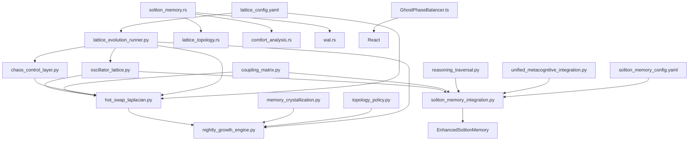

# O2 Soliton Memory System - Dependency Graph

## Core Dependencies



## Import Relationships

### Python Core Dependencies

#### hot_swap_laplacian.py
```python
from oscillator_lattice import OscillatorLattice
from coupling_matrix import CouplingMatrix
from chaos_control_layer import ChaosControlLayer
import numpy as np
```

#### nightly_growth_engine.py
```python
from hot_swap_laplacian import HotSwapLaplacian
from memory_crystallization import MemoryCrystallizer
from topology_policy import TopologyPolicy
from soliton_memory_integration import EnhancedSolitonMemory
```

#### soliton_memory_integration_modified.py
```python
from python.core.oscillator_lattice import get_global_lattice
from python.core.coupling_matrix import CouplingMatrix
from python.core.reasoning_traversal import ConceptNode, ReasoningPath, PrajnaResponsePlus
from python.core.unified_metacognitive_integration import SolitonMemorySystem, MetacognitiveContext
```

#### lattice_evolution_runner_modified.py
```python
from oscillator_lattice import OscillatorLattice
from coupling_matrix import CouplingMatrix
from chaos_control_layer import ChaosControlLayer
from nightly_growth_engine import NightlyGrowthEngine
from hot_swap_laplacian import integrate_hot_swap_with_ccl
from soliton_memory_integration import EnhancedSolitonMemory
```

### Rust Dependencies

#### soliton_memory_modified.rs
```rust
use crate::wal::{WalEntry, WalWriter};
use crate::lattice_topology::{LatticeTopology, KagomeTopology};
```

#### lattice_topology.rs
```rust
use crate::soliton_memory::{SolitonMemory, SolitonLattice};
```

#### comfort_analysis.rs
```rust
use crate::soliton_memory::{ComfortVector, SolitonMemory};
use crate::lattice_topology::LatticeTopology;
```

### Test Dependencies

#### test_hot_swap_laplacian.py
```python
from python.core.hot_swap_laplacian import HotSwapLaplacian
from python.core.oscillator_lattice import OscillatorLattice
from python.core.chaos_control_layer import ChaosControlLayer
```

#### test_dark_solitons.py
```python
from python.core.soliton_memory_integration import EnhancedSolitonMemory, MemoryType
```

#### test_topology_morphing.py
```python
from python.core.hot_swap_laplacian import HotSwapLaplacian
from python.core.lattice_topology import LatticeTopology
```

#### test_memory_consolidation.py
```python
from python.core.soliton_memory_integration import EnhancedSolitonMemory
from python.core.memory_crystallization import MemoryCrystallizer
```

## Module Hierarchy

```
TORI System
├── Core Infrastructure
│   ├── oscillator_lattice.py (existing)
│   ├── coupling_matrix.py (existing)
│   └── chaos_control_layer.py (existing)
│
├── Hot-Swap System (NEW)
│   ├── hot_swap_laplacian.py
│   ├── topology_policy.py
│   └── lattice_topology.rs
│
├── Soliton Memory (ENHANCED)
│   ├── soliton_memory_integration.py (modified)
│   ├── soliton_memory.rs (modified)
│   ├── memory_crystallization.py
│   └── comfort_analysis.rs
│
├── Evolution & Growth (NEW)
│   ├── lattice_evolution_runner.py (modified)
│   ├── nightly_growth_engine.py
│   └── blowup_harness.py
│
├── Frontend (NEW)
│   └── GhostPhaseBalancer.ts
│
├── Configuration
│   ├── lattice_config.yaml (modified)
│   └── soliton_memory_config.yaml
│
└── Tests & Examples
    ├── tests/*.py
    ├── examples/hot_swap_o2_demo.py
    └── benchmarks/benchmark_soliton_performance.py
```

## Key Integration Points

1. **Hot-Swap Integration**: The `integrate_hot_swap_with_ccl()` function in `hot_swap_laplacian.py` connects the hot-swap system to the existing Chaos Control Layer.

2. **Memory System Integration**: `EnhancedSolitonMemory` extends the base `SolitonMemorySystem` and integrates with the global oscillator lattice via `get_global_lattice()`.

3. **Growth Engine**: The `NightlyGrowthEngine` orchestrates all nightly operations including memory crystallization, topology optimization, and comfort-based adjustments.

4. **Rust-Python Bridge**: The Rust components (`soliton_memory.rs`, `lattice_topology.rs`) would typically be compiled to a shared library and accessed via FFI or PyO3 bindings.

5. **Configuration Flow**: YAML configs are loaded by their respective modules and propagate settings throughout the system.

## External Dependencies

### Python
- numpy
- scipy (for sparse matrices)
- asyncio
- dataclasses
- datetime
- logging
- hashlib
- enum
- collections

### Rust
- serde
- chrono
- anyhow
- tracing
- tokio
- uuid
- md5

### Frontend
- React
- TypeScript
- Three.js (for 3D visualization)
