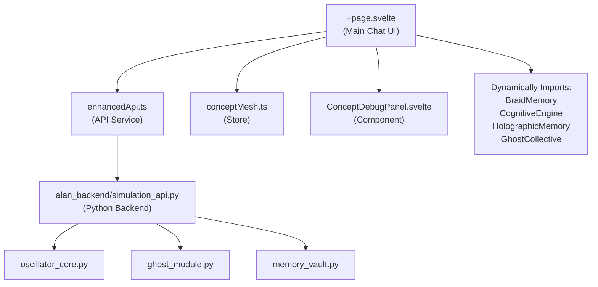

# TORI System File Dependency Graph

## 🌟 Core Entry Points



## 🧠 Soliton Memory Dependency Chain

```
soliton_memory.rs (Rust)
    ↓ compiles to
libconcept_mesh.dll
    ↓ loaded by
solitonMemory.js (FFI Bridge)
    ↓ used by
soliton_user.js
    ↓ imported by
demo_soliton_consciousness.js
    ↓ integrates with
GhostSolitonIntegration.ts
    ↓ monitors
Phase States & Emergence
```

## 🔗 Import/Export Relationships

### **Frontend Dependencies**:
```
tori_ui_svelte/src/routes/+page.svelte
├── IMPORTS:
│   ├── from 'svelte' → onMount, afterUpdate, tick
│   ├── from '$lib/stores/conceptMesh' → conceptMesh, addConceptDiff
│   ├── from '$lib/components/ConceptDebugPanel.svelte' → default
│   └── from '$lib/services/enhancedApi' → enhancedApiService
│
├── RECEIVES DATA FROM:
│   └── +page.server.ts → user authentication data
│
├── DYNAMICALLY LOADS:
│   ├── './systems/BraidMemory'
│   ├── './systems/CognitiveEngine'
│   ├── './systems/HolographicMemory'
│   └── './systems/GhostCollective'
│
└── EMITS EVENTS TO:
    ├── conceptMesh store
    ├── WebSocket connections
    └── Backend API calls
```

### **Soliton Memory Dependencies**:
```
concept-mesh/src/soliton_memory.rs
├── USES:
│   ├── std::collections::HashMap
│   ├── serde::{Deserialize, Serialize}
│   ├── chrono::{DateTime, Utc}
│   └── uuid::Uuid
│
├── DEFINES:
│   ├── struct SolitonMemory
│   ├── struct SolitonLattice
│   ├── enum VaultStatus
│   └── trait SechFunction
│
└── EXPORTS (via FFI):
    ├── soliton_init_user
    ├── soliton_store_memory
    ├── soliton_recall_concept
    ├── soliton_recall_by_phase
    └── soliton_find_related
```

### **Ghost Integration Dependencies**:
```
src/services/GhostSolitonIntegration.ts
├── IMPORTS:
│   └── from './GhostMemoryVault' → ghostMemoryVault
│
├── LISTENS TO EVENTS:
│   ├── 'tori-koopman-update'
│   ├── 'tori-lyapunov-spike'
│   ├── 'tori-soliton-phase-change'
│   ├── 'tori-concept-diff'
│   └── 'tori-user-context-change'
│
├── EMITS EVENTS:
│   ├── 'tori-phase-state-update'
│   └── 'tori-ghost-emergence'
│
└── INTERFACES WITH:
    ├── PhaseState monitoring
    ├── PersonaTrigger conditions
    └── GhostEmergenceEvent handling
```

## 📊 Service Layer Connections

### **Enhanced API Service**:
```
$lib/services/enhancedApi.ts
│
├── HTTP ENDPOINTS:
│   ├── POST /api/chat → Main conversation
│   ├── GET /api/memory/stats → Memory statistics
│   ├── POST /api/memory/store → Store memory
│   ├── GET /api/ghost/status → Ghost state
│   ├── POST /api/concept/add → Add concept
│   └── GET /api/concept/graph → Get concept graph
│
├── WEBSOCKET CHANNELS:
│   ├── /ws/concepts → Real-time concept updates
│   ├── /ws/ghost → Ghost emergence events
│   └── /ws/memory → Memory sync events
│
└── INTEGRATES WITH:
    ├── Backend Python API (alan_backend)
    ├── MCP Bridge (when enabled)
    └── Local storage (for caching)
```

## 🔄 Circular Dependencies & Shared Resources

### **Concept Mesh Store**:
```
conceptMesh.ts is used by:
├── +page.svelte (main chat)
├── ConceptDebugPanel.svelte (visualization)
├── enhancedApi.ts (updates)
└── GhostSolitonIntegration.ts (monitoring)
```

### **User Authentication Flow**:
```
+layout.server.ts
    ↓ provides user data
+layout.svelte
    ↓ wraps all pages
[All route components]
    ↓ access user context
Backend API calls
```

## 🏗️ Build & Compilation Dependencies

### **Rust → JavaScript**:
```
1. concept-mesh/Cargo.toml defines Rust dependencies
2. cargo build --release creates libconcept_mesh.dll
3. solitonMemory.js loads DLL via ffi-napi
4. JavaScript services use the bridge
```

### **TypeScript → JavaScript**:
```
1. tsconfig.json defines compilation rules
2. Svelte preprocessor handles .ts files
3. Vite bundles for browser
4. Runtime imports resolve dependencies
```

## 🚦 Critical Path Dependencies

### **For Chat to Work**:
```
MUST HAVE:
1. Backend API running (simulation_api.py)
2. Frontend server (npm run dev)
3. Valid user authentication
4. WebSocket connection established

OPTIONAL BUT RECOMMENDED:
1. Soliton engine compiled (for persistent memory)
2. MCP bridge running (for enhanced tools)
3. Ghost monitoring active (for personas)
```

### **For Soliton Memory**:
```
REQUIRED:
1. Rust library compiled
2. FFI bridge loaded
3. User initialized

FALLBACK:
- JavaScript in-memory implementation
```

## 📍 File Location Quick Reference

```
tori/kha/
├── tori_ui_svelte/          # Frontend
│   ├── src/
│   │   ├── routes/          # Pages
│   │   ├── lib/             # Shared code
│   │   │   ├── stores/      # Svelte stores
│   │   │   ├── services/    # API services
│   │   │   └── components/  # UI components
│   │   └── app.html         # HTML template
│   └── package.json         # Dependencies
│
├── concept-mesh/            # Rust memory engine
│   ├── src/
│   │   └── soliton_memory.rs
│   └── Cargo.toml
│
├── alan_backend/            # Python backend
│   └── server/
│       ├── simulation_api.py
│       └── [other modules]
│
├── ImSpecial/               # JavaScript implementations
│   ├── soliton_user.js
│   └── demo_soliton_consciousness.js
│
├── src/services/            # TypeScript services
│   └── GhostSolitonIntegration.ts
│
└── mcp-server-architecture/ # MCP integration
    └── src/
        └── [MCP modules]
```

This shows exactly how each file depends on and connects to others in the TORI ecosystem!
