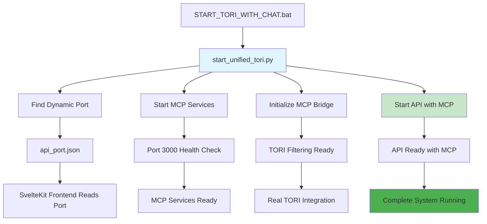

# 🚀 Unified TORI Launcher - Usage Guide

## What Changed

**OLD SYSTEM**: 
- `START_TORI_WITH_CHAT.bat` → `start_dynamic_api.py` → API without MCP ❌

**NEW SYSTEM**: 
- `START_TORI_WITH_CHAT.bat` → `start_unified_tori.py` → API with MCP ✅

## How to Launch TORI

### 1. Standard Launch
```bash
# Double-click or run:
START_TORI_WITH_CHAT.bat
```

### 2. Manual Launch (if needed)
```bash
# From tori/kha directory:
python start_unified_tori.py
```

## What Happens During Startup

The unified launcher performs these steps in order:

1. **🔫 Cleanup** - Kills any existing processes on ports 8002-8012, 3000, 3001
2. **🔍 Port Discovery** - Finds first available port starting from 8002  
3. **📝 Config Save** - Saves `api_port.json` for frontend to discover
4. **🚀 MCP Startup** - Starts MCP services on port 3000
5. **⏳ Health Check** - Waits up to 30 seconds for MCP to be ready
6. **🔗 Bridge Init** - Initializes MCP bridge with TORI filtering
7. **🌐 API Launch** - Starts API server with full MCP integration

## Debugging Startup Issues

### Quick Status Check
```bash
# Run this anytime to see what's happening:
python check_tori_status.py
```

### Status Files Created
- `tori_status.json` - Real-time startup progress and error details
- `api_port.json` - Dynamic port configuration for frontend

### Common Issues & Solutions

**MCP Won't Start**
```bash
# Check dependencies:
cd mcp-server-architecture
npm install
```

**Port Conflicts**
```bash
# The launcher auto-kills processes, but if needed:
# Use Windows Task Manager or reboot
```

**Bridge Initialization Fails**
```bash
# Check MCP health first:
curl http://localhost:3000/health
```

## Console Output Guide

### ✅ Success Indicators
- `✅ Found available port: 8002`
- `✅ MCP services started successfully`  
- `✅ MCP bridge initialized successfully`
- `🎯 API SERVER READY:`

### ❌ Error Indicators  
- `❌ Port XXXX is busy`
- `❌ MCP services failed to start within 30 seconds`
- `❌ Launch failed: [error details]`

### ⏳ Progress Indicators
- `⏳ Waiting for MCP services to start...`
- `⏳ Still waiting for MCP... (15/30 attempts)`

## Key Benefits

✅ **No More Guessing** - Clear error messages and progress indicators
✅ **Dynamic Ports** - Automatically finds available ports  
✅ **MCP Integration** - Always includes MCP server integration
✅ **Status Monitoring** - Real-time status files for debugging
✅ **Robust Cleanup** - Handles existing processes gracefully
✅ **Colored Logging** - Easy-to-read console output

## File Status

### Active Files
- `start_unified_tori.py` - **NEW** unified launcher 
- `START_TORI_WITH_CHAT.bat` - **UPDATED** to use unified launcher
- `check_tori_status.py` - **NEW** diagnostic tool

### Legacy Files (still available but not used)
- `start_dynamic_api.py` - Old dynamic launcher without MCP
- `run_stable_server.py` - Old MCP launcher with fixed port

## Troubleshooting Workflow

1. **Something wrong?** → Run `python check_tori_status.py`
2. **Check status files** → Look at `tori_status.json` for exact error
3. **MCP issues?** → Check `mcp-server-architecture` directory and npm install
4. **Still stuck?** → Look at the console window with colored error messages

## Architecture Flow



**Result**: No more two-day debugging sessions! 🎉
